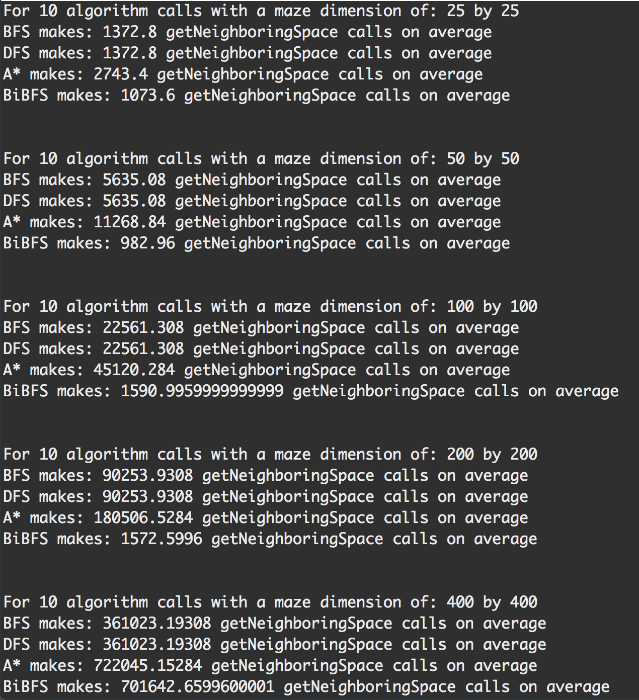

# MazeSolver 

 Much to my surprise, these algorithms performed not as I expected them to perform. Although I read that the A* search algorithm is generally outperformed by other algorithms, I certainly thought that it would not outperform BFS and DFS, especially with our Euclidean-distance heuristics function. Nonetheless, BFS and DFS both outperformed A*. However, this makes sense, for the most part, as A* calls getNeighboringSpace() several times to evaluate and sum both the distance and heuristic functions. For instance, even when A* star has reached the solution node, it calls getNeighboringSpace() to evaluate the sum function and check to see if there is a quicker path to the solution node. This seems kind of pointless but, since A* star is an extension of Dijkstra’s algorithm, I guess the goal is to find the shortest path to the solution node and not to find it in the shortest amount of time.
 

 I also found it surprising that BFS and DFS performed exactly the same as the results show. There was not even a small difference between the average count of getNeighboringSpace() calls. It was quite literally exactly the same results for both DFS and BFS. This was quite interesting. I even doubled checked that I had not mistakenly used the same count constant for both BFS and DFS. The fact that both DFS and BFS had the same values for the maze graph is interesting because the solution point in the graph is pretty deep. So one would think that DFS would be faster than BFS. It does make sense, however, as there is only one deep solution and, thus, DFS has to traverse many branches before it finds the correct branch with the solution. That said, I still did not expect them to have the exact same average count. Super cool to find that in this experiment though!

 As for the Bidirectional BFS, this outperformed all the other algorithms and I was not surprised by this. It make sense that running two BFS algorithms from both ends of the graph would yield a faster result. However, this was only true for mazes of dimension 200 or smaller. Bi-BFS did almost as bad as A* when it came to mazes of size 400. This makes sense as mazes of this dimension require many node traversals and this can be seen in the fact that the average count for Bi-BFS for a maze dimension of 400 was a bit less than twice the average count for BFS for mazes of that size. In other words, Bi-BFS basically had to run two regular BFS searches for a maze of dimension 400. After an hour and forty minutes of waiting for the program to finish and after seeing the results for the algorithms, it is clear that Bidirectional BFS is the overall fastest algorithm for mazes of size 200 or less. For large mazes (dim >= 400), BFS or DFS is better. A* is not practical for any size maze or graph in terms of time performance, but it will definitely result in finding the shortest path distance from start to target node. Overall, the order that I would rank the algorithms from fastest to slowest is:

1. Bidirectional BFS
2. DFS and BFS (tied)
3. A*

 I thought the easiest algorithm to implement was BFS because, for me, it was the most intuitive. I tend to have a hard time wrapping my head around recursion so I sometimes struggle debugging recursive algorithms such as DFS when I encounter a bug. A* was the most difficult to implement because it required proper mathematical calculations of the heuristic function and the total sum function and it also required a lot of variable reassignments that were hard to keep track of. It definitely required a lot of writing out what was going on before implementing it in code. In end, I enjoyed implementing all of these search algorithms and learning about their performance in relation to one another.

## Results

### &copy; Copyright Notice

This project is part of a Graph Algorithms course taught at Pomona College by Visiting Professor, [William Devanny]. My only contribution to this project is the graph algorithm implementations in the MazeSolver class and the Entry class I created. Any other work in this project is subject to copyright laws under the MIT License.

[William Devanny]: http://www.ics.uci.edu/~wdevanny/
